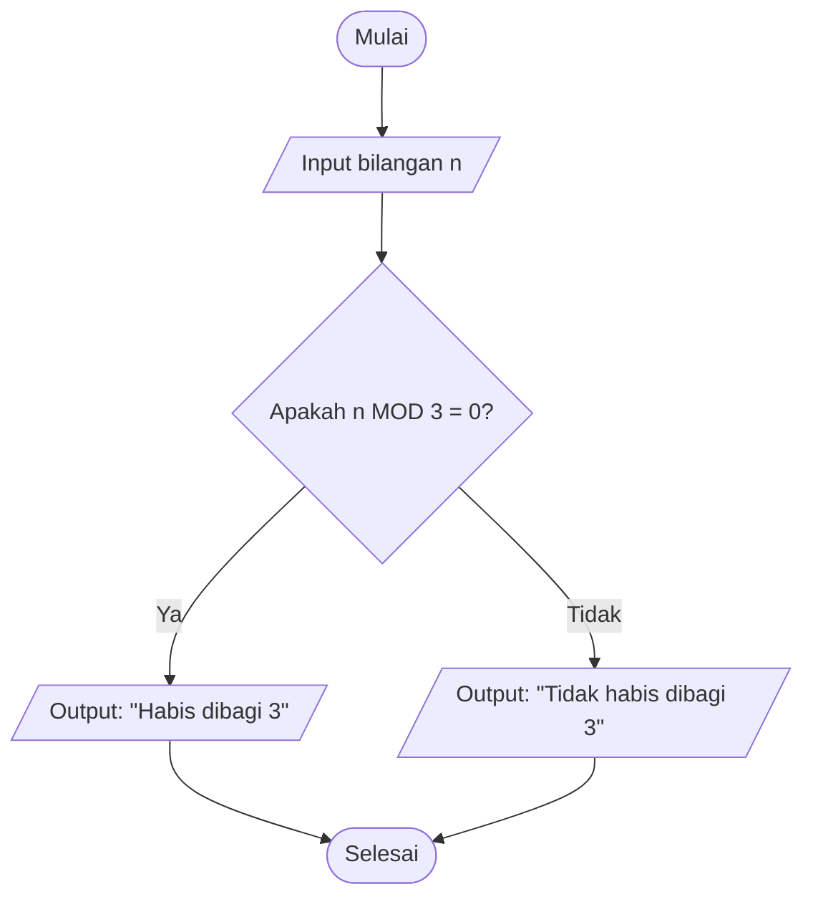

Nama : Ahmad Nurikhsan
Nim   : 2225250042

Menentukan Bilangan Habis Dibagi 3 atau Tidak

1. Deskripsi Masalah 
Diberikan sebuah bilangan bulat nn. Tentukan apakah bilangan tersebut habis dibagi 3 atau tidak. Suatu bilangan dikatakan habis dibagi 3 apabila hasil pembagian bilangan tersebut dengan 3 memiliki sisa 0. Program akan menerima sebuah bilangan sebagai input, kemudian memeriksa sisa pembagiannya dengan 3 dan menampilkan hasil berupa “Habis dibagi 3” atau “Tidak habis dibagi 3”.

2. Identifikasi input, Proses dan output
Komponen	keterangan
Input	Bilangan bulat n
Proses	Menghitung sisa pembagian nn dengan 3 menggunakan n MOD 3n \ MOD\ 3, kemudian memeriksa apakah sisanya 0
Output	“Habis dibagi 3” atau “Tidak habis dibagi 3”

3. Pseudocode
INPUT n

IF n MOD 3 = 0 THEN
    OUTPUT "Habis dibagi 3"
ELSE
    OUTPUT "Tidak habis dibagi 3"
END IF
 

4. Flowchart

 # Flowchart Menentukan Bilangan Habis Dibagi 3 atau Tidak

5. Tes Case dan Verifikasi
No	Input	Perhitungan	Hasil yang Diharapkan 
1	12	12 MOD 3 = 0	Habis dibagi 3
2	10	10 MOD 3 = 1	Tidak  habis dibagi 3
3	21	21 MOD 3 = 0	Habis dibagi 3

6. Implementasi Python
n = int(input("Masukkan bilangan: "))

if n % 3 == 0:
    print("Habis dibagi 3")
else:
    print("Tidak habis dibagi 3")
 

